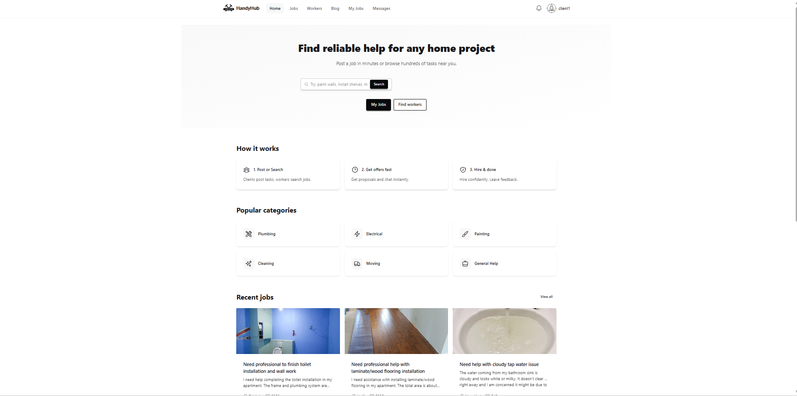
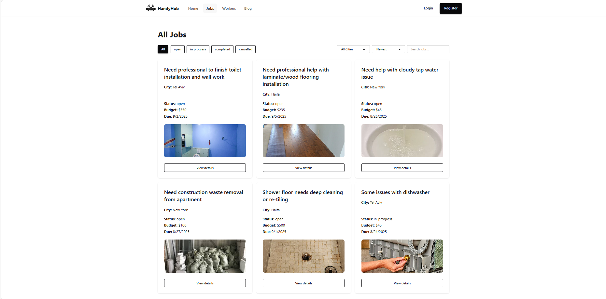
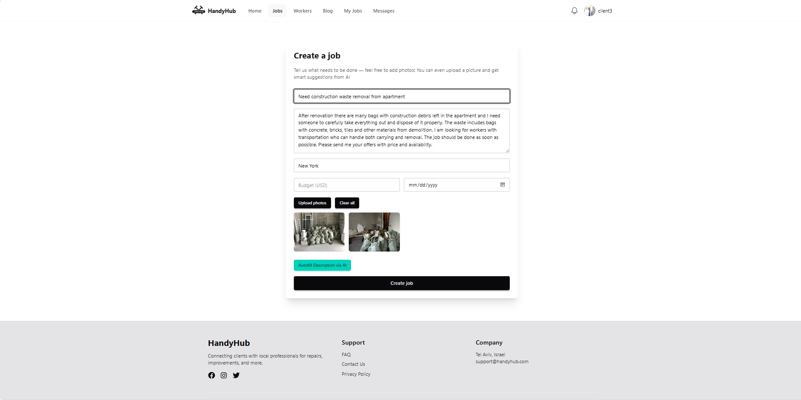
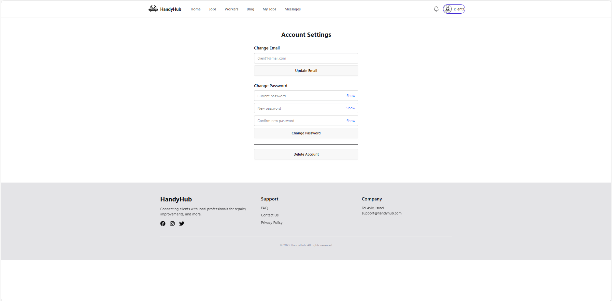

# 🛠️ HandyHub

🌐 **Live Demo:** [handyhub.izegov.dev](https://handyhub.izegov.dev)

**HandyHub** is a full-stack platform for posting and finding home service jobs.  
Clients can create tasks (plumbing, cleaning, moving, etc.), while workers browse and apply for them.  


Built with **React + Redux Toolkit + Vite + Tailwind/DaisyUI** on the frontend and **Node.js + Express + PostgreSQL (Knex)** on the backend.

---


##  Features

-  Authentication (JWT + Refresh tokens)
-  User profiles (clients / workers)
-  Job management (create, update, filter, search)
-  Chat and offers system (Socket.IO)
-  Account settings (update email, change password, delete account)
-  File uploads (photos for jobs)
-  **AI Assistant (OpenAI)**: generates job titles and descriptions from photos
-  Filtering by categories and search
-  Dockerized setup (Postgres + API + Frontend)
-  Email verification
-  Admin panel
-  Worker skills from database
-  Rating & reviews system
-  CI/CD with GitHub Actions
-  AWS deployment with Docker


---

## 🛠 Tech Stack

| Layer | Technology |
|-------|-----------|
| Frontend | React, Redux Toolkit, Vite, Tailwind CSS, DaisyUI |
| Backend | Node.js, Express, Socket.IO |
| Database | PostgreSQL, Knex.js |
| Auth | JWT, Refresh tokens, bcrypt |
| AI | OpenAI API |
| DevOps | Docker, GitHub Actions, AWS EC2, nginx |
| SSL | Let's Encrypt |

## 🚀 Deployment

- **Cloud:** AWS EC2 (t3.micro)
- **Containers:** Docker + Docker Compose
- **Reverse proxy:** nginx
- **SSL:** Let's Encrypt (auto-renewal)
- **CI/CD:** GitHub Actions → SSH deploy on push to main
- **Domain:** [handyhub.izegov.dev](https://handyhub.izegov.dev)

##  Screenshots

###  Home Page


###  Jobs


###  AI feature


###  Settings



---

##  Getting Started

### 1. Clone the repository
```bash
git clone https://github.com/Romaizega/handyhub.git
```

Navigate to the project folder
```bash
cd handyhub
```

Install dependencies:
```bash
npm install
```


---

##  Requirements

- Node.js ≥ 18 (for local development without Docker)
- Docker + Docker Compose
- OpenAI API Key (for AI Assistant)

---

##  Environment Variables

Create a `.env` file in the project root:

```env
# Server
PORT=5000

# JWT
JWT_SECRET=supersecret
REFRESH_SECRET=superrefresh
JWT_EXPIRES_DAY=1d
JWT_EXPIRES_WEEK=7d

# Database (API connects via host=db inside Docker network)
DATABASE_URL=postgres://handyhub:handyhub@db:5432/handyhub

# OpenAI
OPENAI_API_KEY=sk-xxxxxxxxxxxxxxxxxxxxx

# Frontend
PUBLIC_BASE_URL=http://localhost:5000

```

## Run with Docker
Start all services:
```bash
docker compose up --build
```
## Services:

API → http://localhost:5000
Frontend → http://localhost:5173
Postgres → localhost:5432 

## Database Setup
Run migrations after containers start:
```
docker compose exec api npx knex migrate:latest
```

## Auth API (Postman quick test)
Base URL: http://localhost:5000/api/auth

    Register → POST /register
```
{ "username":"user1", "email":"u1@mail.com", "password":"Passw0rd1", "role":"client" }
```

    Login → POST /login
```
{ "username":"user1", "password":"Passw0rd1" }
```
{ "username":"user1", "password":"Passw0rd1" }
→ returns { accessToken } + refreshToken cookie
   
    Me → GET /me (Bearer accessToken)

    Change email → PATCH /email { "email":"new@mail.com" }

    Change password → PATCH /password { "currentPassword":"Old1", "newPassword":"NewPass123" }

    Delete account → DELETE /me

---

##  Roadmap

```yaml
planned_features:
  - AI:
      - [x] Generate job titles & descriptions from uploaded photos
      - [ ] Suggest budget ranges automatically
      - [ ] Detect job categories (plumbing, painting, etc.)
      - [ ] Estimate completion time
  - User:
      - [x] Authentication & profiles
      - [x] Account settings (email, password, delete)
      - [ ] Two-factor authentication (2FA)
      - [x] User reviews & ratings
      - [x] Email verification
  - Jobs:
      - [x] CRUD operations with photo uploads
      - [ ] Job categories & tagging improvements
      - [ ] Job bookmarking/favorites
  - Communication:
      - [x] Real-time chat with Socket.IO
      - [ ] Push notifications
      - [ ] Email notifications
  - Payments:
      - [ ] Stripe integration
      - [ ] PayPal integration
  - Infrastructure:
      - [x] Dockerized setup
      - [x] CI/CD with GitHub Actions
      - [x] Production deployment AWS

```

### Author:
[Roman Izegov](https://github.com/Romaizega)